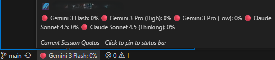

# 🌌 Antigravity Omni-Quota

**Antigravity Omni-Quota** is a high-performance VS Code extension designed to provide a unified, secure, and multi-platform dashboard for monitoring Antigravity AI quotas. 

Unlike standard tools that only show the current session, **Omni-Quota** acts as a central hub for all your accounts, allowing you to track quotas, remaining credits, and reset periods across multiple identities in a single interface.

---

## 🌟 What's New in v1.1.1 (Universal Edition)

- **🌍 Full Cross-Platform Support**: Native compatibility with **Windows**, **macOS**, and **Linux** (including WSL).
- **🛡️ Secure Storage Engine**: Sensitive CSRF tokens are now protected using the VS Code `SecretStorage` (system keychain). No more plaintext tokens.
- **📈 Usage History**: Background recording of quota snapshots. Ready for the upcoming analytics dashboard in v1.2.0.
- **🩺 Proactive Diagnostics**: Automatic detection of missing system tools (like `lsof`) with guided repair for Unix users.

---

## 🚀 Key Features

- **🚀 Zero-Config Discovery**: Automatic detection of Antigravity's internal API port and CSRF token.
- **🔗 Multi-Account Hub**: Store and monitor all your Antigravity accounts simultaneously. No more logging in and out just to check your limits.
  

- **📊 Professional Dashboard**: High-fidelity status bar tooltips showing up to **8 models** with health colors.
  

- **🎨 Visual Health Indicators**: Dynamic color-coded icons (Green, Yellow, Orange, Red) in the sidebar.
- **🕒 Accurate Countdowns**: Real-time relative clock updates (every 10s) optimized for the Antigravity reset cycle.
- **📊 Quick Menu Access**: Sleek integration to quickly switch focus between models.
  

- **🌍 Global Localization**: Fully translated into **8+ languages**: English, Español, Русский, 中文, 한국어, 日本語, Français, and Deutsch.
  

---

## 💻 System Requirements

- **Windows**: No additional steps required (uses PowerShell).
- **macOS / Linux / WSL**: Requires `lsof` (standard on most systems). The extension will guide you if it's missing.

---

## 💖 Support the Development

This extension is developed and maintained for free. if Omni-Quota has saved you time or frustration, consider supporting its development:

👉 **[Donate via PayPal](https://paypal.me/RicardoGurrola146)**

Your support helps maintain the project and fuels the development of new features like the upcoming Consumption Analytics (v1.2.0).

---

## 📄 License

This project is licensed under the **MIT License** - see the [LICENSE](LICENSE) file for details.

---
*Developed for the Antigravity community.*