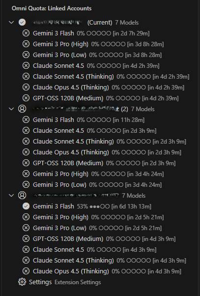
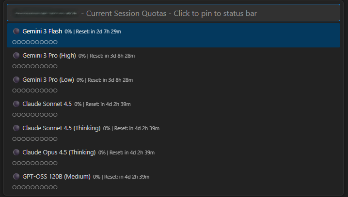
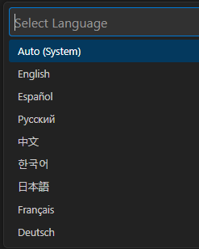

# 🌌 Antigravity Omni-Quota

**Antigravity Omni-Quota** is a high-performance VS Code extension designed to provide a unified, persistent, and multi-language dashboard for monitoring Antigravity AI quotas. 

Unlike standard tools that only show the current session, **Omni-Quota** acts as a central hub for all your accounts, allowing you to track quotas, remaining credits, and reset periods across multiple identities in a single interface.

---

## 🚀 Key Features
## 🌟 Key Features

- **🚀 Zero-Config Discovery**: Automatic detection of Antigravity's internal API port and CSRF token.
- **🌍 Universal Support**: Native compatibility with **Windows**, **macOS**, and **Linux** (including WSL).
- **🛡️ Secure Storage**: Protects your session tokens using the VS Code `SecretStorage` (system keychain).
- **📊 Professional Dashboard**: High-fidelity tooltips showing up to 8 models with health colors.
- **🕒 Accurate Countdown**: Real-time relative clock updates (every 10s) optimized for the Antigravity reset cycle.
- **📈 Usage History**: Background tracking of your token consumption (ready for future analytics).

## 💻 Multi-Platform Requirements

- **Windows**: No additional steps required.
- **macOS / Linux**: Requires `lsof` (standard on most systems). The extension will guide you if it's missing.

- **🔗 Multi-Account Hub**: Store and monitor all your Antigravity accounts simultaneously. No more logging in and out just to check your limits.
  

- **🎨 Visual Health Indicators**: Dynamic color-coded icons (Green, Yellow, Orange, Red) in the sidebar to understand your quota health at a glance.
- **⏲️ High-Accuracy Countdowns**: Real-time reset timers and optimized polling for immediate quota updates.
- **📊 Quick Menu Access**: A sleek status bar integration with a "Quick Pick" menu to quickly switch focus between models and view granular details.
  

- **🌍 Global Localization**: Fully translated into **8+ languages**, including English, Español, Русский, 中文, 한국어, 日本語, Français, and Deutsch.
  
- **💾 Persistent State**: Your accounts are safely stored in VS Code's global storage, ensuring they are there every time you open your editor.

---

## 🛠️ Technical Highlights

- **Intelligent Bootstrapping**: Automatically repairs legacy account data to ensure accurate countdowns.
- **Optimized Performance**: Dual-interval polling system (Fast UI updates vs. full system scans) ensures low CPU usage.
- **Process Discovery**: Cross-platform logic (Windows/Unix) for robust port detection and API communication.

For a deeper dive into how this works, check out our [Technical Architecture](./docs/TECHNICAL_ARCHITECTURE.md).

---

## 📂 Documentation

Detailed documentation is available in the `docs/` folder:
- [**Overview & Benefits**](./docs/OVERVIEW.md) - Why use Omni-Quota?
- [**Technical Architecture**](./docs/TECHNICAL_ARCHITECTURE.md) - Deep dive into scanning and persistence.
- [**File Breakdown**](./docs/FILE_BREAKDOWN.md) - Guide for developers on the source code structure.

---

## 📥 Installation & Setup

1. **Clone the repository**:
   ```bash
   git clone https://github.com/RicardoGurrola15/Antigravity-Omni-Quota.git
   ```
2. **Install dependencies**:
   ```bash
   npm install
   ```
3. **Compile**:
   ```bash
   npm run compile
   ```
4. **Run**:
   Open the project in VS Code and press `F5` to launch a new Extension Development Host window.

---

## ⚙️ Configuration

Customize the extension to your workflow via **Settings > Extensions > Antigravity Omni-Quota**:
- Change the interface **Language**.
- Adjust **Polling Intervals** to balance frequency and performance.
- Set **Warning & Critical Thresholds** for visual cues.
- Toggle visibility for specific models (Pro, Flash, etc.).

---

## 📄 License

This project is licensed under the MIT License.